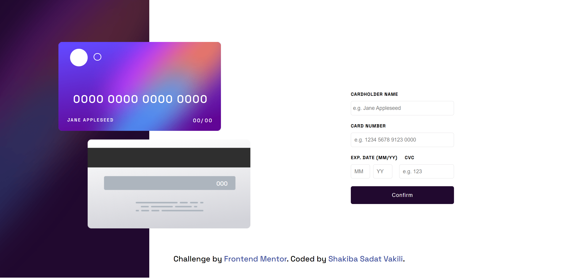

# Interactive Card Details Form

Welcome to my solution for the [Interactive Card Details Form challenge on Frontend Mentor](https://www.frontendmentor.io/challenges/interactive-card-details-form-XpS8cKZDWw)! This project is aimed at enhancing your coding skills through practical challenges, providing an opportunity to delve into modern web development techniques.

## Technologies Used

This project is built using a combination of modern web technologies, ensuring a robust and responsive user experience:

- **Semantic HTML5 markup:** Utilized for structuring the content, ensuring accessibility and search engine optimization.
- **CSS custom properties:** Employed to create reusable styles and maintain consistency throughout the design.
- **Flexbox:** Applied for flexible layout options, allowing elements to align and distribute space dynamically.
- **CSS Grid:** Utilized for precise and efficient layout management, enabling complex designs with ease.
- **JavaScript:** Implemented to add interactivity and enhance user engagement, providing a seamless experience.

## Preview

Explore the sleek and intuitive interface of the Interactive Card Details Form:

## Additional Resources

Feel free to reach out to me for collaborations, inquiries, or just to say hi. I'm always excited to connect with fellow developers and enthusiasts:

- **LinkedIn:** Let's connect for collaborations and discussions about the latest trends in web development. [Shakiba Sadat Vakili](https://www.linkedin.com/in/shakiba-vakili/)
- **Email:** Reach out to me at [shakibvakili@gmail.com](mailto:shakibvakili@gmail.com) for any inquiries or collaborations.
- **GitHub:** Visit [@shakiba-vakili](https://github.com/shakiba-vakili) on GitHub to explore more projects and contributions.

## 🌟 Star this Repository

If you found this project helpful or interesting, consider giving it a star! ⭐️ Your support encourages me to continue creating exciting projects and sharing knowledge with the community. Thank you!
